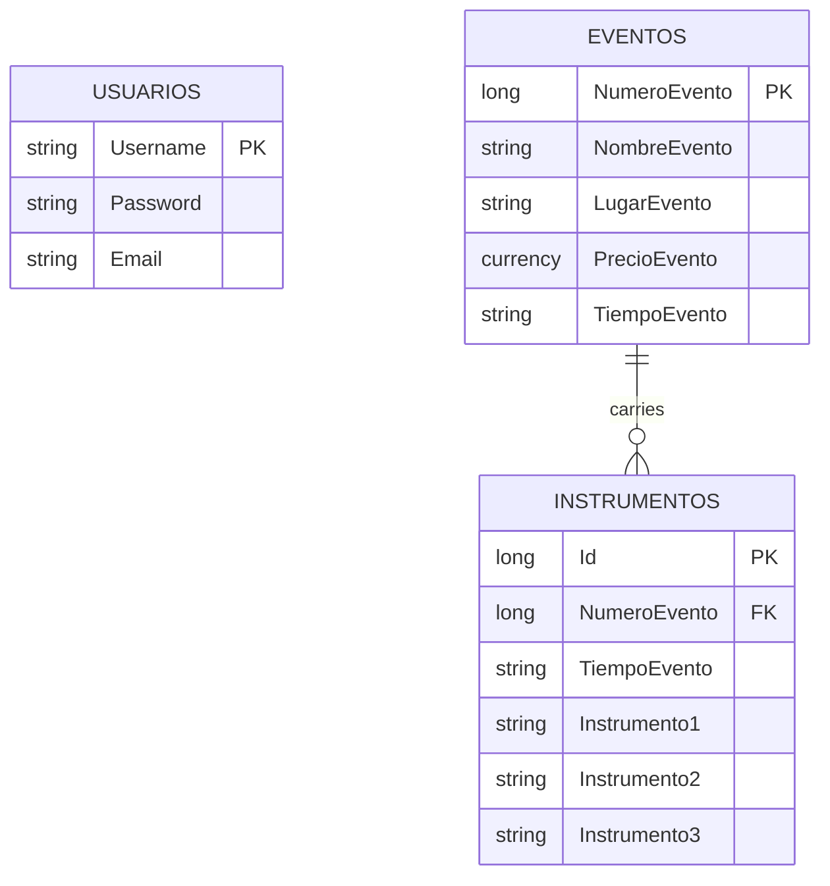

# Organization App — Event Itinerary & Instrument Inventory

Final Project for **COMP4400 — System Development and Implementation**
Universidad Interamericana de Puerto Rico, Ponce Campus
Professor: Dr. Raquel Lugo · May 11, 2023

**Author:**  Radamés Toro Morales

## Description

A desktop application (Windows Forms, VB.NET) built to help a musical
artist or band organize their gigs: for every event it stores the
venue, the event name, the duration, the fee, and the instruments that
need to come along. The idea grew out of repeatedly seeing artists
with busy schedules struggle to stay organized, and aims to give them
a simple, table-based tool to solve that.

## Objective

- Show the app's purpose and how it works.
- Walk through the diagrams used during planning (sequence,
  communication, ERD).
- Demonstrate the code and the running application.

## Features

1. **Login / create account** — a sign-in screen with the option to
   register a new user (username, password, email).
2. **Register events** — number, name, venue, duration, and price for
   each event, in a table that supports creating, saving, and deleting
   records.
3. **Register instruments** — up to three instruments tied to each
   event's duration.
4. **Exit the program** from the main menu.

## Architecture



`Usuarios` (Users) is independent — it only controls access.
`Eventos` (Events) and `Instrumentos` (Instruments) are related through
`NumeroEvento`. This schema recreates the original project's ERD and
data dictionary (see `/database/schema.sql`); column names were kept
in Spanish to match what's actually used in the application (e.g.
`LugarEvento` rather than a literal translation), while this
documentation is in English.

## Data Dictionary (Eventos / Events table)

| Field         | Type     | Size | Description                                      |
|---------------|----------|------|---------------------------------------------------|
| NumeroEvento  | Number   | 10   | Unique event ID (PK)                              |
| NombreEvento  | Text     | 25   | Name of the event being performed                 |
| LugarEvento   | Text     | 20   | Address of the venue where the event takes place  |
| PrecioEvento  | Currency | 8    | Fee the artist/band will charge for the event      |
| TiempoEvento  | Text     | 20   | Duration of the event                             |

## Tech Stack

- **Language:** VB.NET (Windows Forms), `net8.0-windows`
- **Database:** Microsoft Access (`.accdb`) via `System.Data.OleDb`
- **Original IDE:** Visual Studio 2022

> The original project was built against .NET Framework using the
> `Microsoft.ACE.OLEDB.12.0` provider. This repository targets the
> modern .NET SDK (`net8.0-windows`) so it builds with `dotnet build`
> without requiring a full Visual Studio install, while keeping the
> same Access database provider.

## Repository Structure

```
├── ProyectoSE.sln
├── src/ProyectoSE/
│   ├── ProyectoSE.vbproj
│   ├── App.config                  # Access connection string
│   ├── Program.vb                  # entry point
│   ├── Data/
│   │   └── DatabaseHelper.vb       # OleDb connection and adapters
│   └── Forms/
│       ├── FrmLogin.vb / .Designer.vb          # sign-in screen
│       ├── FrmCreateAccount.vb / .Designer.vb  # create-account screen
│       └── FrmItinerario.vb / .Designer.vb     # main screen
├── database/
│   ├── schema.sql                  # reference DDL (Access SQL)
│   └── CreateAccessDatabase.vbs    # creates ProyectoEvento.accdb (ADOX)
└── docs/
    └── (planning diagrams — see Architecture section)
```

## How to Run It

**Requirements:**
- Windows 10/11
- [.NET 8 SDK](https://dotnet.microsoft.com/download) (or Visual Studio 2022 with the ".NET desktop development" workload)
- [Microsoft Access Database Engine 2016 Redistributable](https://www.microsoft.com/download/details.aspx?id=54920) (only needed if Access itself isn't installed)

**Steps:**

1. Clone the repository.
2. Create the database: open a terminal in `database/` and run
   ```
   cscript CreateAccessDatabase.vbs
   ```
   This generates `ProyectoEvento.accdb` with the `Usuarios`,
   `Eventos`, and `Instrumentos` tables. (Alternative: create the
   tables by hand in Access using `schema.sql`.)
3. Copy `ProyectoEvento.accdb` into
   `src/ProyectoSE/bin/Debug/net8.0-windows/` (or update the
   `Data Source` path in `App.config`).
4. Build and run:
   ```
   dotnet run --project src/ProyectoSE/ProyectoSE.vbproj
   ```
5. On first run there won't be any users yet — use **SIGN IN** to
   create an account, then **LOGIN** to access the itinerary manager.


## Testing Phase

The app was first tested with dummy data to observe its behavior;
once no errors appeared, testing continued with real data, and after a
positive result it was shown to management. The code was then
reviewed before installation, and finally checked to confirm the
installation didn't conflict with other programs.

## Maintenance Phase

To extend the program's lifespan, the plan is to update it
periodically and review vulnerabilities that could expose confidential
information. Radamés is responsible for watching for vulnerabilities
and for applying updates.

## Future of the Application

- A calendar with date-based reminders/notifications.
- A visual refresh to make it more appealing.
- Making it accessible to a younger audience (middle school, high
  school, and college students).

## Conclusion

Good organization is key to a successful production. This application
aims to help musical artists and bands — and anyone with a busy
schedule of commitments — stay organized and avoid conflicts between
events.

## References

- Knott, R. (n.d.). *Cómo hacer un manual de usuario: guía completa.* TechSmith. https://www.techsmith.es/blog/manual-usuario/
- Testing, M. (2020). *Tipos y etapas de las pruebas de software.* Mundo Testing. https://mundotesting.com/etapas-de-pruebas-de-software-etapas-del-testing/
- *Guía de desarrollo de software a medida.* (2022). Evaluando Software. https://www.evaluandosoftware.com/software-a-medida/mantenimiento-de-software/

## License

Distributed under the MIT License — see [`LICENSE`](LICENSE).
